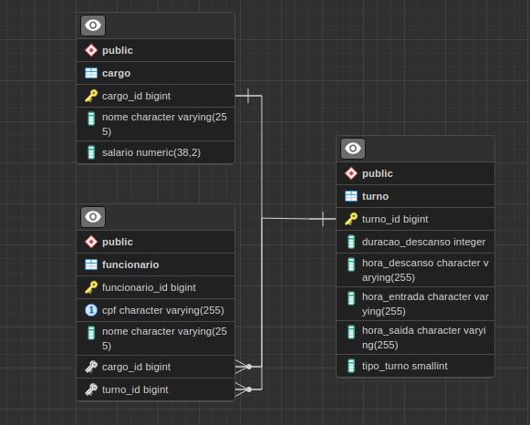
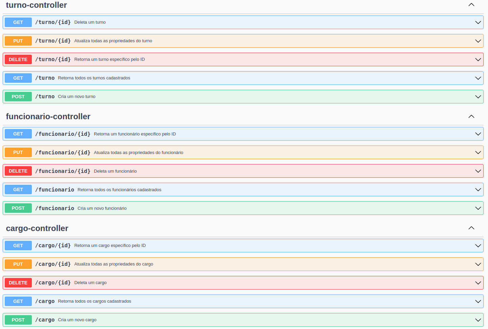

<h1 align="center">API funcionario</h1>

A simple API did for Serratec Course.

<h2 align="center">Database</h2>

<h2 align="center">Swagger Documentation</h2>

Tecnologies:
 Spring 3.0.6
 Flyway
 PostgreSQL
 Swagger
 Java 17

